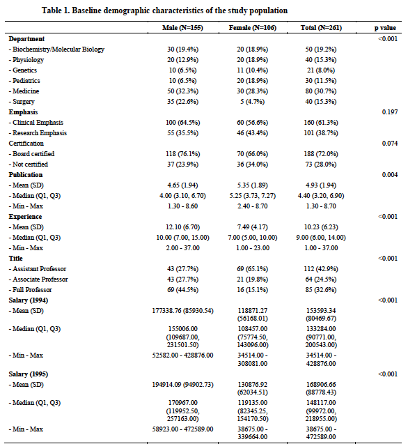
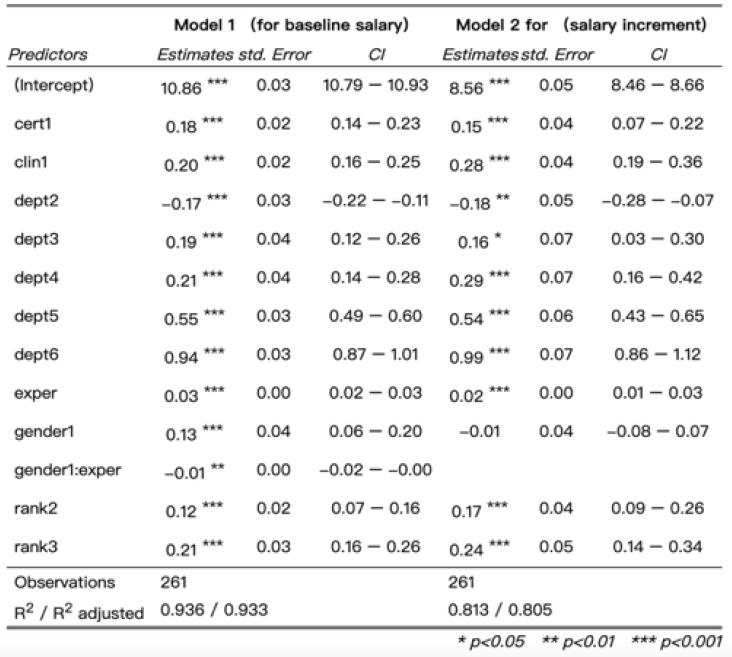
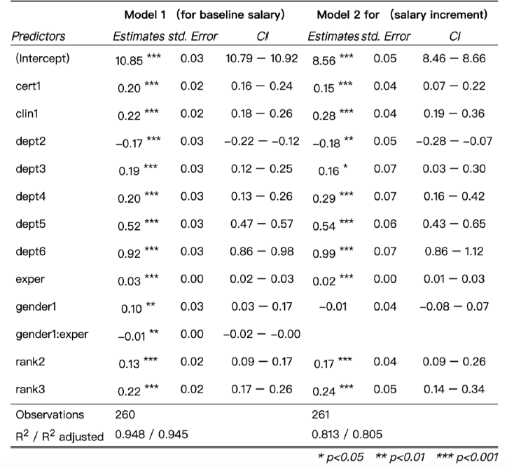

```{r setup, include=FALSE}
library(MASS)
library(dplyr)
library(tidyverse)
library(knitr)
library(broom)
library(faraway)
library(arsenal)
library(caret)
library(kableExtra)
```

# Introduction

Income inequality between men and women has been a point of debate over the years. To find our own answers, our team sought to examine the association between salary and gender at the Houston college of medicine. This was a cross-sectional study based on the salaries among faculties with varying expertise in the field of medicine. We created two regression models of baseline salary in 1994 and the increment of salary between 1994 and 1995, according to gender, department, years of experience, work emphasis, certification status, and rank. We found that gender was significantly associated with salary setting at baseline but that it was not a determining factor for the salary increase from between 1994 and 1995.

Title VII of the Civil Rights Act of 1964 is a federal law that prohibits employers from discriminating against employees on the basis of sex, race, color, national origin and religion. Also, the equal pay act of 1963 requires that men and women in the same workplace be given equal pay for equal work. However, the U.S education system is one area that is not immune to this income gap problem. Several factors determine one’s compensation in the education system. Despite these legitimate factors that determine compensation, there are many cases that have been published claiming that female professors are getting paid less compared to their male colleagues while bearing the same, if not superior, titles or accolades.
The aim of this study is to examine the association between gender discrimination in setting salary within the Houston college of medicine where a female professor claimed, through a district court lawsuit, that there was evidence of discrimination against women in giving promotions and setting salaries. To support this, we built multiple regressionmodels using six predictor variables such as the subject's department, their area of expertise, whether or not they are board-certified, years of experience, and their position title. We tested for interactions and confounders that might be present between all the stated predictors and our main predictor of interest: the subject’s gender. Our response variables were the baseline salary in 1994 and the change in salary between 1994 and 1995.

# Methods

## Data Description

* Deptartment: Academic departments at Houston College of medicine. Biochemistry, Physiology, Genetics, Pediatrics, Medicine, and Surgery
* Gender: A dichotomous variable coded with dummy variables '1' for Male subjects and '0' for Female subjects
* Emphasis: A dummy variable with 1 = Primarily clinical emphasis and 0 = Primarily research emphasis.
* Certification: 1 = Board certified and 0 = not certified
* Publication: Publication rate 
* Experience: years of experience since obtaining Medical Doctor degree.
* Title: 1 = Assistant professor, 2 = Associate professor, 3 = full professor
* Salary (1994): Salary in academic year 1994
* Salary (1995): Salary in academic year 1995.

**Loading and Tidying the dataset**

```{r, message=FALSE}
lawsuit_df =
  read_csv("Data/Lawsuit.csv") %>% 
  janitor::clean_names() %>%
  rename("Department" = "dept", "Emphasis" = "clin", "Certification" = "cert",
         "Title" = "rank", "Experience" = "exper", "Publication" = "prate",
         "Salary (1994)" = "sal94", "Salary (1995)" = "sal95") %>%
  dplyr::mutate(
    Department = factor(Department, levels = c("1", "2", "3",
                                   "4", "5", "6")),
    gender = factor(gender, levels = c("1", "0")),
    Emphasis = factor(Emphasis, levels = c("1", "0")),
    Certification = factor(Certification, levels = c("1", "0")),
    Title = factor(Title, levels = c("1", "2", "3"))) %>% 
  mutate(
    gender = recode(gender, "1" = "Male", "0" = "Female"),
    Department = recode(Department, "1" = "Biochemistry", 
                        "2" = "Physiology", "3" = "Genetics",
                  "4" = "Pediatrics", "5" = "Medicine", "6" = "Surgery"),
    Emphasis = recode(Emphasis, "1" = "Clinical", "0" = "Research"),
    Certification = recode(Certification, "1" = "certified", 
                           "0" = "Not certified"),
    Title = recode(Title, "1" = "Assistant Professor", 
                   "2" = "Associate Professor", "3" = "Full Professor")) %>%
  arrange(gender)
```

The dataset for analysis has 261 observations of 8 variables. The distributions of salary amount in 1994 and 1995 were originally skewed. A natural log transformation was applied to these two variables to exhibit a normal distribution.

```{r, message=FALSE}
p1 = 
  lawsuit_df %>% 
  ggplot(aes(x = `Salary (1994)`)) + 
  geom_histogram(aes(x = `Salary (1994)`, y = ..density..), alpha = .7) +
  geom_density(aes(x = `Salary (1994)`)) +
  theme(plot.title = element_text(hjust = .5)) +
  labs(
    x = "Untransformed Salary (1994)") +
  theme_bw() +
  ggsci::scale_fill_lancet()

p2 = 
  lawsuit_df %>% 
  ggplot(aes(x = `Salary (1995)`)) + 
  geom_histogram(aes(x = `Salary (1995)`, y = ..density..), alpha = .7) +
  geom_density(aes(x = `Salary (1995)`)) +
  theme(plot.title = element_text(hjust = .5)) +
  labs(
    x = "Untransformed Salary (1995)") +
  theme_bw() +
  ggsci::scale_fill_lancet()

gridExtra::grid.arrange(p1, p2, ncol = 2)

lawsuit_df = 
  lawsuit_df %>% 
  mutate(log_sal94 = log(`Salary (1994)`),
         log_sal95 = log(`Salary (1995)`),
         sal_increase = log(`Salary (1995)` - `Salary (1994)`))


p3 = 
  lawsuit_df %>%
  ggplot(aes(x = log_sal94)) + 
  geom_histogram(aes(x = log_sal94, y = ..density..), alpha = .7) + 
  geom_density(aes(x = log_sal94)) +
  theme(plot.title = element_text(hjust = .5)) +
  labs(
    x = "Log-Transformed Salary (1994)") +
  theme_bw() +
  ggsci::scale_fill_lancet()
p4 = 
  lawsuit_df %>%
  ggplot(aes(x = log_sal95)) + 
  geom_histogram(aes(x = log_sal95, y = ..density..), alpha = .7) + 
  geom_density(aes(x = log_sal95)) +
  theme(plot.title = element_text(hjust = .5)) +
  labs(
    x = "Log-Transformed Salary (1995)") +
  theme_bw() +
  ggsci::scale_fill_lancet()
gridExtra::grid.arrange(p3, p4, ncol = 2)
```


```{r}
a = lawsuit_df %>%
  ggplot(aes(x = gender, fill = Department, y = log_sal94), alpha = .6) +
  geom_col(position = "dodge") +
  ggsci:::scale_fill_lancet() +
  theme_bw() +
  labs(y = "salary in 1994",
       title = "Salary vs Department") 
b = lawsuit_df %>%
  ggplot(aes(x = gender, fill = Emphasis, y = log_sal94),alpha = .6) +
  geom_col(position = "dodge") +
  ggsci:::scale_fill_lancet() +
  theme_bw() +
  labs(y = "salary in 1994",
       title = "Salary vs Work Emphasis")
gridExtra::grid.arrange(a, b, nrow = 2)
c = lawsuit_df %>%
  ggplot(aes(x = gender, fill = Certification, y = log_sal94),alpha = .6) +
  geom_col(position = "dodge") +
  ggsci:::scale_fill_lancet() +
  theme_bw() +
  labs(y = "salary in 1994",
       title = "Salary vs Certification")
d = lawsuit_df %>%
  ggplot(aes(x = gender, fill = Title, y = log_sal94),alpha = .6) +
  geom_col(position = "dodge") +
  ggsci:::scale_fill_lancet() +
  theme_bw() +
  labs(y = "salary in 1994",
       title = "Salary vs Rank")
gridExtra::grid.arrange(c, d, nrow = 2)
```


The barplots above show the distribution of the 1994 salary against different predictor variables according to a subject's gender. For instance, the first figure shows that overall surgeons are paid more compared to other specializations and that male surgeons are paid more compared to female surgeons at the Houston College of Medicine. Additionally, male full professors get paid more compared to female full professors. I will further explore what might be the reason for this when I build my models.


**Graphical Representation of potential interation between years of experience and salary adjusted for a subject's gender:**

Below I will graphically explore the years of experience variable in relation to both the 1994 salary and salary increase from 1994 to 1995. It is important to highlight that salary has a linear relationship with years of experience. It is also important to highlight that if the lines are not parallel, it is evidence that the relationship between years of experience and salary will be determined by a subject's gender, further validating the hypothesis of a presence of gender discrimination when it comes to salary setting.


```{r}
lawsuit_df %>% 
  ggplot(aes(x = Experience, y = log_sal94, color = gender)) + 
  geom_point() + 
  geom_smooth(method = "lm", se = FALSE) + 
  facet_grid(~Department) + 
  theme_bw()
```

In the scatterplot above, all lines cross which means that in all six departments, when all other variables are fixed, years of experience will not be the sole factor in determining the 1994 salary, gender will too.

```{r}
lawsuit_df %>% 
  ggplot(aes(x = Experience, y = sal_increase, color = gender)) + 
  geom_point() + 
  geom_smooth(method = "lm", se = FALSE) + 
  facet_grid(~Department) + 
  theme_bw()
```

As the previous scatterplot, the effect of years of experience toward salary increase will be modified by a subject's gender, except in the `Pediatrics` department where there is not evidence of gender being a effect modifier of the relationship between years of experience and salary increase.


### Table 1.

Table 1 shows that the departments of Physiology, Genetics and Pediatrics had a significantly higher proportion of female faculties compared to the male, while the department of Surgery had a significantly lower proportion of female faculties. There was no significant difference in both clinical or research emphasis as well as certification between both genders. The results also presented that years after obtaining MD for females were shorter than that of males. By comparing the rank, which was also a proxy for productivity, the proportion of full professors among female faculties was much lesser than males.


```{r, eval=FALSE}
# Cleaning output
tab1_controls = tableby.control(
               total = T,
               test = T,
               numeric.stats = c("meansd", "medianq1q3", "range"),
               cat.stats = "countpct",
               stats.labels = list(
               meansd = "Mean (SD)",
               medianq1q3 = "Median (Q1, Q3)",
               range = "Min - Max",
               countpct = "N (%)"))

tab1 = tableby(gender ~ Department + Emphasis + Certification + Publication +
                  Experience + Title + `Salary (1994)` + `Salary (1995)`,
                data = lawsuit_df, control = tab1_controls)
summary(tab1, title = 'Descriptive Statistics', digits = 2, text = T)
```





## Model Building

I built two models for the analysis of the association between gender and salary. For Model 1, the goal was to check whether there was gender discrimination in the baseline salary in 1994. Since the main outcome was the salary amount and the main variable of interest was gender, I first regressed the salary in 1994 with only `gender` to test the direct association, and then added the potential confounders one at a time to see if these variables created a confounding effect. If the coefficient of `gender` changed directionality and/or there was a significant difference (10% in magnitude) after adding a new variable to the model, that variable would be considered a confounder. After checking all the potential confounders, interaction terms were added to the model for analyzing any interaction between gender and other factors. The second model generally followed the same structure as the first, However the main outcome in the second model was slightly different since it focused more on the salary increase from 1994 to 1995 rather than the baseline salary between both genders. The main response variable for both models were all log-transformed. There was one influential point in the dataset. I later decided to fit both models without the influential point after comparing the models fitted with and without it. The significance level in this study was set at **0.05**.

### Model Information

Model 1 accounted for the association between gender and baseline salary in 1994, adjusting for the department, work emphasis, certification, years since obtaining MD (years if experience) and Title. Model 2 accounted for the association between gender and salary increase in 1995, adjusting for the same variables. While there was no interaction effect in Model 2, Model 1 considered the interaction between gender and years of experience. Model diagnostics showed that both of the final models met the assumptions of multilinear regression and there was one influential point in the data.

**Checking for confounders:**

```{r, message=FALSE}
# fit
attach(lawsuit_df)
#based model
fit.base = lm(log_sal94 ~ gender)
summary(fit.base)

# see if there is any confounder
output_model = vector()
output_add_var = vector()

for (i in 2:7 ) {
  var = names(lawsuit_df)[i] # ensure correct var names
  formula = as.formula(str_c("log_sal94 ~ gender +", var))
  print(str_c("log_sal94 ~ gender +", var))
  output_model = append(output_model, str_c("log_sal94 ~ gender +", var))
  output_add_var = append(output_add_var, var)
  }

confounder_check = tibble(model = output_model,
                             add_var = output_add_var)

regression = function(formula){
  formula = as.formula(formula)
  fit = lm(formula , data = lawsuit_df)
  return(as.tibble(broom::tidy(fit)))
}

confounder_check = 
  confounder_check %>%
  mutate(reg = map(confounder_check$model,regression)) %>%
  unnest() %>%
  filter(p.value < .05) %>%
  filter(term == "genderMale") %>%
  mutate(confounder = ifelse(abs((estimate - 0.38624)/0.38326) > 0.1, "confounder","not confounder" )) %>%
  dplyr::select(-term)


confounder_check %>% kable(format = "latex", booktabs = T, caption = "Potential Confounders") %>%
  kable_styling(latex_options = c("striped", "hold_position"),
                full_width = F)
# all are confounders

#
summary(lm(log_sal94 ~ gender + Department + Emphasis + Certification + 
             Publication + Experience + Title, data = lawsuit_df))

```


**Model 1 and 2 fitted with influential point:**

```{r, message=FALSE}
# test interaction between gender and other varibales
output_model = vector()
output_add_var = vector()

for (i in 2:6 ) {
  var = names(lawsuit_df)[i] # ensure correct var names
  formula = as.formula(str_c("log_sal94 ~ gender + Department + Emphasis + Certification + Publication + Experience + Title +","gender*", var))
  print(str_c("log_sal94 ~ gender + Department + Emphasis + Certification + Publication + Experience + gender *", var))
  output_model = append(output_model, str_c("log_sal94 ~ gender + Department + Emphasis + Certification + Publication + Experience + Title + gender *", var))
  output_add_var = append(output_add_var, var)
}

inter_check = 
  tibble(model = output_model,
       inter_with = output_add_var) %>%
  mutate(reg = map(model,regression)) %>%
  unnest() %>%
  filter(p.value < .05) %>%
  filter(str_detect(term, ":"))
inter_check


summary(lm(log_sal94 ~ gender + Department + Emphasis + Certification + Publication + Experience + gender * Emphasis + gender * Experience , data = lawsuit_df))

interact.fit_1 = lm(log_sal94 ~ gender + Department + Emphasis + Certification + Experience + gender * Emphasis + gender * Experience , data = lawsuit_df)
summary(interact.fit_1)
interact.fit_2 = lm(log_sal94 ~ gender + Department + Emphasis + Certification + Publication + Experience + gender * Emphasis + gender * Experience, 
                    data = lawsuit_df)
summary(interact.fit_2)

anova(interact.fit_1,interact.fit_2) 
# anova shows that smaller model(without publication) is superior (interact.fit_1)
# however, publication is a confounder, we still should include that variable 
#the resulting model is as below:
summary(interact.fit_2)
summary(interact.fit_1)

#final model
interact.fit_1 = lm(log_sal94 ~ gender + Department + Emphasis + Certification + Experience + Title +  gender * Experience, data = lawsuit_df)
summary(interact.fit_1)
```



The influential point indicated that a male faculty with only 2 years of working experience had an extremely high salary compared to others. I fitted another model without this influential point and below is the diagnostics showing the influntial point (113).

**Diagnostics for model 1 with the influential point:**

```{r}
par(mfrow = c(2,2))
plot(interact.fit_1)
```


**Model 1 and 2 fitted without the influential point:**

```{r}
lawsuit_df = lawsuit_df[-113,]

# test interaction between gender and other varibales
output_model = vector()
output_add_var = vector()

for (i in 2:6 ) {
  var = names(lawsuit_df)[i] # ensure correct var names
  formula = as.formula(str_c("log_sal94 ~ gender + Department + Emphasis + Certification + Publication + Experience + Title +","gender*", var))
  print(str_c("log_sal94 ~ gender + Department + Emphasis + Certification + Publication + Experience + gender *", var))
  output_model = append(output_model, str_c("log_sal94 ~ gender + Department + Emphasis + Certification + Publication + Experience + Title + gender *", var))
  output_add_var = append(output_add_var, var)
}

inter_check = 
  tibble(model = output_model,
       inter_with = output_add_var) %>%
  mutate(reg = map(model,regression)) %>%
  unnest() %>%
  filter(p.value < .05) %>%
  filter(str_detect(term, ":"))
inter_check


summary(lm(log_sal94 ~ gender + Department + Emphasis + Certification + Publication + Experience + gender * Emphasis + gender * Experience , data = lawsuit_df))

interact.fit_3 = lm(log_sal94 ~ gender + Department + Emphasis + Certification + Experience + gender * Emphasis + gender * Experience , data = lawsuit_df)
summary(interact.fit_3)
interact.fit_4 = lm(log_sal94 ~ gender + Department + Emphasis + Certification + Publication + Experience + gender * Emphasis + gender * Experience, 
                    data = lawsuit_df)
summary(interact.fit_4)

anova(interact.fit_3,interact.fit_4) 
# anova shows that smaller model(without publication) is superior (interact.fit_1)
# however, publication is a confounder, we still should include that variable 
#the resulting model is as below:
summary(interact.fit_4)
summary(interact.fit_3)

#final model
interact.fit_3 = lm(log_sal94 ~ gender + Department + Emphasis + Certification + Experience + Title +  gender * Experience, data = lawsuit_df)
summary(interact.fit_3)
```




However, considering the salary increase between 1994 and 1995 based on Model 2, gender only had a slight influence on the difference in the increment. Surprisingly, even though males had a higher baseline salary, females tend to receive a larger salary increase compared to male subjects. There was a relatively smaller association between males and the salary increase, which implied that gender equality in the income growth was almost achieved in 1995, though the inequality still existed at the baseline level of salary of 1994.

**Diagnostics for model 1 without the influential point:**

```{r}
par(mfrow = c(2,2))
plot(interact.fit_3)
```


For further analysis, Model 1 was stratified by each of the included confounders. While being stratified by the departments, the results showed that males were more likely to receive higher baseline salaries than females in the Department of Physiology and Medicine. The gender difference still existed after adjusting for other confounders except for experienced years. While adjusting for experienced years, I found that there was no significant difference in baseline salary between both genders.


