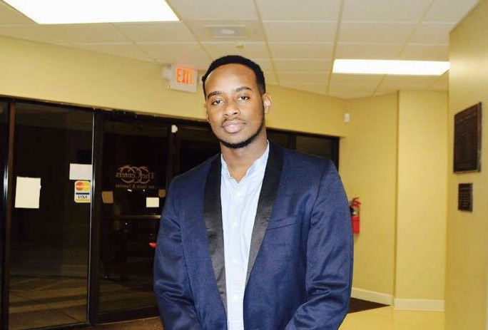

I am an ambitious and dynamic scientist, working on a masters degree in Biostatistics at Columbia Mailman School of Public Health. 

During my undergraduate education in chemistry at the University of Central Arkansas, I served in different professional and research roles. As a result, I have a wide range of experience working at academic institutions, small companies (start ups), and research labs. 

I am a proactive learner, always seeking out challenging opportunities with an ultimate purpose to grow personally and professionally. 

I am also an aspiring data scientist, constantly looking to get involved in challenging projects in order to apply my analytical problem-solving skills and translate big picture ideas into tangible goals.

